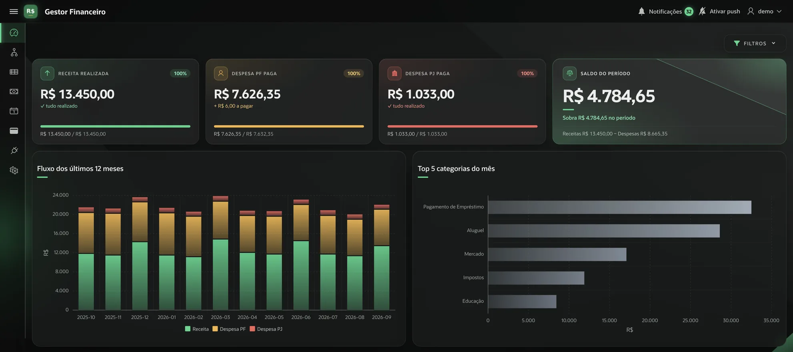

# Gestor Financeiro


<p align="justify">Aplicação de gestão financeira pessoal e de pessoa jurídica construída em <b>Oracle APEX</b> sobre <b>Autonomous Database</b>, em produção e em uso diário.</p>

**[Abrir a demonstração](https://gd9477458323ab8-gestorfin.adb.sa-saopaulo-1.oraclecloudapps.com/ords/r/gestor_financeiro/gestor-financeiro/)**. Usuário `demo`, senha `demo`.

<p align="justify">A conta de demonstração tem dados fictícios e é restaurada todo dia de madrugada. Fique à vontade para criar, editar e excluir.</p>



## O que faz

<p align="justify">Lançamentos de receita e despesa separados por pessoa física e jurídica, com regime de competência e de caixa; dívidas parceladas com recálculo de parcelas e baixa vinculada ao lançamento; anexos por lançamento; notificações de vencimento por e-mail e push; um dashboard com indicadores do período, fluxo de doze meses e categorias mais pesadas; e uma tela de acessos que mostra quem entrou, de onde, com que aparelho, e as tentativas que falharam.</p>

## Stack

| Camada | Tecnologia |
|---|---|
| Banco | Oracle AI Database 26ai Autonomous, versão 23.26.3.3.0, região sa-saopaulo-1 |
| Aplicação | Oracle APEX 26.1.4, modo de compatibilidade 24.2 |
| REST | ORDS, com OpenAPI 3.0 gerado pelo próprio servidor |
| Front-end | Universal Theme 42, JavaScript, HTML e CSS |
| Offline | PWA instalável, com fila em IndexedDB |
| Notificações | Web Push nativo do APEX e e-mail por template |

## Decisões técnicas

<p align="justify"><b>Controle de acesso e conteúdo.</b> Toda tabela que guarda dado de usuário tem política de VPD (<code>DBMS_RLS</code>), com o predicado vindo de <code>PKG_RLS</code> e <code>update_check</code> ligado, então cada usuário só enxerga as próprias linhas. O predicado é aplicado pelo banco, não pela tela, então vale também para o que chega por parâmetro de requisição e não só para o que a página consulta. O código está em <a href="db/security/01_rls_policies.sql"><code>db/security/01_rls_policies.sql</code></a> e <a href="db/packages/pkg_rls.sql"><code>db/packages/pkg_rls.sql</code></a>.</p>

<p align="justify"><b>Autenticação própria.</b> Esquema custom com hash e salt por usuário (<code>PKG_AUTH</code>), bloqueio por tentativas, expiração de senha, troca forçada no primeiro acesso e trilha de eventos de login. Inclui o "manter conectado" do APEX com revogação de token ao desativar, trocar papel ou resetar senha de uma conta.</p>

<p align="justify"><b>A origem do acesso vem do cabeçalho, não do banco.</b> Atrás do balanceador da OCI, <code>sys_context</code> devolve sempre o mesmo endereço, e o módulo Oracle no lugar do navegador. O pacote lê <code>X-Forwarded-For</code> e <code>User-Agent</code> da requisição, pegando o último item da lista, que é o que a infraestrutura escreveu e o cliente não forja. Fora de uma requisição HTTP a leitura falha por desenho e o valor antigo continua valendo, então job e script não quebram.</p>

<p align="justify"><b>Fila offline idempotente.</b> O app é um PWA instalável; sem rede, os lançamentos vão para uma fila em IndexedDB e sobem quando a conexão volta. A idempotência não depende do cliente: um índice único funcional sobre <code>external_id</code> garante que reenviar a mesma fila duas vezes não duplica nada. Ver <a href="pwa/"><code>pwa/</code></a> e <a href="db/security/02_indice_idempotencia_offline.sql"><code>db/security/02_indice_idempotencia_offline.sql</code></a>.</p>

<p align="justify"><b>Plug-in de verdade, não JavaScript colado na página.</b> O tooltip da aplicação é um plug-in de Dynamic Action com render function em PL/SQL, atributos configuráveis no Page Designer e cores saindo de variáveis do Universal Theme, então sobrevive a troca de theme style. O instalável em <a href="apex/plugin/"><code>apex/plugin/</code></a> sai do export do App Builder, nunca escrito à mão.</p>

<p align="justify"><b>Regra de negócio no banco.</b> Nenhum CRUD em processo de página: tudo passa por package (<code>PKG_FIN_LANCAMENTOS</code>, <code>PKG_FIN_DIVIDAS</code>, <code>PKG_FIN_NOTIF</code>, <code>PKG_CFG_*</code>), o que mantém a regra fora da tela e testável por SQL.</p>

## API REST

<p align="justify">A conta de demonstração também pode ser consultada por uma API REST publicada no ORDS. A leitura não exige autenticação:</p>

```bash
curl -H "Accept: application/json" https://gd9477458323ab8-gestorfin.adb.sa-saopaulo-1.oraclecloudapps.com/ords/gestor_financeiro/v1/resumo
```

```json
{"periodo":{"de":"2026-09-01","ate":"2026-09-30"},
 "receitas":13450,"despesas":{"pf":7626.35,"pj":1033},"saldo":4790.65,
 "realizado":{"receitas":13450,"despesas":7934.35},
 "previsto":{"receitas":0,"despesas":725},"lancamentos":16}
```

<p align="justify">No <code>/resumo</code>, <b>realizado</b> são os lançamentos com data de caixa e <b>previsto</b> os que ainda não têm.</p>

| Método | Caminho | Autenticação |
|---|---|---|
| GET | `/v1/lancamentos` | aberta |
| GET | `/v1/lancamentos/{id}` | aberta |
| GET | `/v1/categorias` | aberta |
| GET | `/v1/resumo` | aberta |
| POST | `/v1/ingest/lancamentos` | OAuth2 |

<p align="justify">A especificação OpenAPI 3.0 é gerada pelo próprio ORDS em <a href="https://gd9477458323ab8-gestorfin.adb.sa-saopaulo-1.oraclecloudapps.com/ords/gestor_financeiro/open-api-catalog/v1/"><code>open-api-catalog/v1/</code></a>.</p>

### Escrita

<p align="justify">A escrita exige OAuth2 com <i>client credentials</i>. O cliente abaixo é público: só tem acesso ao endpoint de escrita, grava apenas na conta de demonstração, aceita até 100 lançamentos por dia, e os dados são restaurados toda madrugada.</p>

```bash
TOKEN=$(curl -s -X POST https://gd9477458323ab8-gestorfin.adb.sa-saopaulo-1.oraclecloudapps.com/ords/gestor_financeiro/oauth/token \
  -H "Accept: application/json" \
  --user "ph6pTsyiEUfRUJTi8pxkyw..:JALdTI0-6OPlnnkLyiCslQ.." \
  -d grant_type=client_credentials | sed -n 's/.*"access_token":"\([^"]*\)".*/\1/p')

CHAVE=$(uuidgen)

curl -i -X POST https://gd9477458323ab8-gestorfin.adb.sa-saopaulo-1.oraclecloudapps.com/ords/gestor_financeiro/v1/ingest/lancamentos \
  -H "Accept: application/json" \
  -H "Authorization: Bearer $TOKEN" \
  -H "Content-Type: application/json" \
  -H "Idempotency-Key: $CHAVE" \
  -d '{"tipo":"DPF","descricao":"Assinatura de streaming","valor":39.9,
       "data_competencia":"2026-09-20","categoria_id":9}'
```

<p align="justify">Executando o último comando duas vezes no mesmo terminal, a primeira chamada responde <code>201</code> e a segunda <code>200</code> com <code>Idempotent-Replay: true</code>, devolvendo o lançamento já gravado mesmo que o corpo enviado seja outro. A unicidade é garantida por um índice único funcional sobre <code>external_id</code>, restrito às linhas gravadas pela API, no mesmo modelo do índice usado pela fila offline do PWA.</p>

### Implementação

<p align="justify"><b>Handlers sem SQL.</b> Cada handler chama uma rotina de <a href="db/packages/pkg_api_v1.sql"><code>PKG_API_V1</code></a> e devolve o JSON montado por ela. A conta de demonstração é fixa no pacote e nenhuma rotina recebe id de usuário, então não há parâmetro que dê acesso a outra conta. Um lançamento de outra conta retorna <code>404</code>, sem indicar se ele existe.</p>

<p align="justify"><b>Filtro explícito em vez de política de linha.</b> Fora de uma sessão APEX, o predicado de <a href="db/packages/pkg_rls.sql"><code>PKG_RLS</code></a> retorna <code>1=0</code>, e dentro do pacote, que roda com os privilégios de <code>ADMIN</code>, a política não se aplica. Por isso o filtro da conta está escrito em todas as consultas do pacote.</p>

<p align="justify"><b>Prefixo separado para a escrita.</b> No ORDS, o privilégio é associado a um padrão de URI ou a um módulo, não a um método HTTP. Para manter o <code>GET</code> aberto e o <code>POST</code> protegido, a escrita fica em <code>/v1/ingest/</code>, que é o padrão coberto pelo privilégio.</p>

<p align="justify"><b>Paginação por keyset.</b> A listagem ordena por data de competência e id, e o campo <code>next</code> traz a posição do último item. Diferente do <code>OFFSET</code>, a página não se desloca quando entram lançamentos novos.</p>

<p align="justify"><b>ETag do ORDS.</b> Os templates usam o ETag padrão do ORDS, calculado sobre a resposta, que retorna <code>304</code> quando o <code>If-None-Match</code> confere. A opção por consulta de assinatura (<code>p_etag_type</code> <code>QUERY</code>) foi descartada porque teria de considerar o cursor de cada página.</p>

<p align="justify"><b>Erros.</b> Os erros gerados pelo pacote saem em <code>application/problem+json</code>, com código próprio e sem expor <code>ORA-</code>. Os gerados pelo ORDS antes do handler, como o <code>401</code> sem token, dependem do cabeçalho <code>Accept</code>: sem pedir JSON, clientes como o Postman recebem a página de erro em HTML. Por isso os exemplos enviam <code>Accept: application/json</code>.</p>

## Organização

| Pasta | Conteúdo |
|---|---|
| `db/tables` | DDL das tabelas de negócio e de configuração |
| `db/packages` | Pacotes PL/SQL: autenticação, RLS, lançamentos, dívidas, notificações, cadastros e expurgo |
| `db/functions` | Utilitários chamados pelos pacotes: preferência, data no fuso de Brasília, indicadores de acesso |
| `db/security` | Políticas de VPD, o índice de idempotência da fila offline e a view de acessos |
| `db/jobs` | Jobs do scheduler: expurgo por retenção e geração diária de notificações |
| `apex/plugin` | Plug-in de tooltip: instalável e render function |
| `ords` | Módulo, templates, handlers, privilégio e cliente OAuth2 da API |
| `pwa` | Camada offline da página, a tela offline que o APEX embute no service worker que ele mesmo gera, e os dois processos de sincronização da fila |

## Sobre este repositório

<p align="justify">É um recorte do projeto, não a aplicação inteira. Está aqui o que se lê como código: modelo de dados, regra de negócio e os componentes que valem reuso. O export completo do APEX, os scripts de migração e os dados ficam de fora por conterem informação financeira real.</p>

## Autor

Cleiton Cruz, desenvolvedor Oracle APEX e PL/SQL.
[linkedin.com/in/cleitonrcruz](https://www.linkedin.com/in/cleitonrcruz/)
